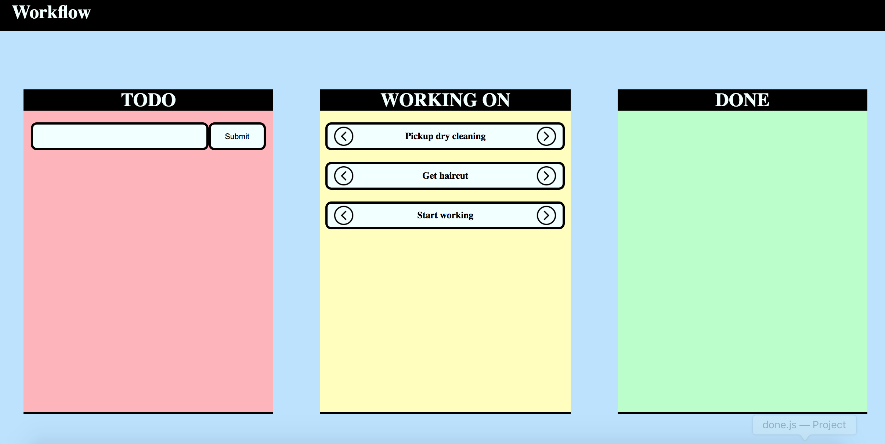

# Workflow 

Workflow is a glorified todo list which allows you to track the tasks you have to do, tasks your working on, and tasks that you have completed. You can either make an account through the signup form or login using your Google Account. This will allow you to safe your todo list and access it anywhere you want. This web application was built using ReactJS and Firebase as a backend to save user data. 

# Inspiration 

When I'm working I like to see the progress I'm making in a more visual way. I just feel like seeing everything layed out infront of me makes me feel more productive. I wanted to create something like that for myself and for anyone else that might want to use a todo list like that. One challenge I took on with this project was to add a backend for the users data and than retrieve the user data. This was something I always saw as challenging and I decided to try my hand at it. Another challenge I took on with this project was adding User Authentication, which is another thing that I saw as challenging, however it was quite achieveable. 

# Do you have any future plans with this project ?

I would love to try my hand at making the user interface more appealing. In addition, I want to find ways to optimize reads and writes to the database that way they are not as frequent. Lastly, I want to add the ability to edit a task after it has been written. These are all small things which I plan on working on soon. 

# Picture 

